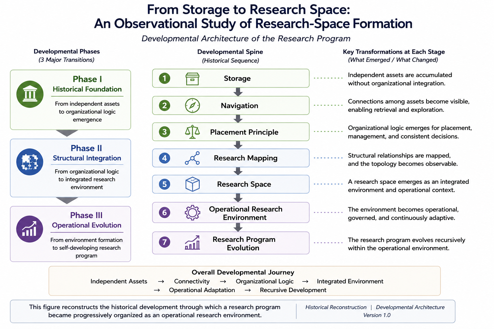

# From Storage to Research Space

## Status

Working Manuscript

Overview Paper

Version: v1.0

---

## Title

**From Storage to Research Space:  
An Observational Study of Research-Space Formation**

---

## Figure

---

## Abstract

This paper reconstructs the historical process through which independently accumulated research assets gradually became organized into an operational research environment.

Rather than introducing a new theoretical framework, the study examines how organizational principles, research mapping, and research-space formation emerged through historical reconstruction across independently developed research assets.

Historical reconstruction suggests the following developmental sequence:

Storage

↓

Navigation

↓

Placement Principle

↓

Research Mapping

↓

Research Space

↓

Operational Research Environment

↓

Research Program Evolution

The paper argues that this sequence was reconstructed retrospectively from accumulated observational records rather than being explicitly designed beforehand.

---

## Manuscript Scope

This overview paper reconstructs the developmental architecture of the research program through:

- historical reconstruction
- organizational interpretation
- research-space formation
- operational environment formation
- research-program evolution

---

## Related Documents

### Research Program Evolution

- Historical Validation Emergence

### Research Space Topology

- Developmental Topology Invariance (Hypothesis)

### Research Mapping

- Case61 — Historical Reconstruction
- Case62 — Paper Assembly
- Case63 — Cross-Layer Placement Principle
- Case64 — Historical Consistency Review

---

## Supplementary Material

Additional notes, observations, and supporting materials are available in:

- supplementary.md

---

## Historical Context

This manuscript is based on the historical reconstruction documented in the AI Text Project Hub Repository.

- **Formation History:** [From Storage to Research Space](https://github.com/ai-text-project/ai-text-project-hub/blob/main/0-emergence-notes/01-formation-history/00-from-storage-to-research-space.md)

---

## Related Research Space Topology

The broader structural implications of this document are further discussed in the following Research Space Topology observation:

- **Developmental Topology Invariance (Hypothesis)**

https://github.com/ai-text-project/ai-text-project-hub/blob/main/03-research-space-topology/02-developmental-topology-invariance-hypothesis.md
