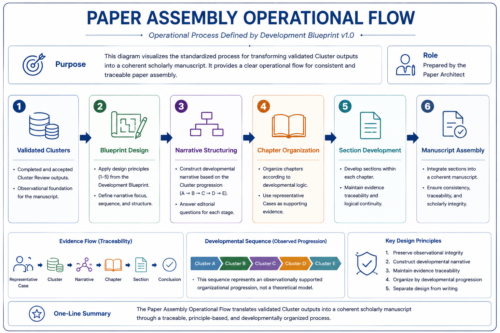

# Abstract

## Status

Ready

---

## Purpose

This directory stores the abstract of the paper.

The abstract provides a concise overview of the completed research and serves as the primary entry point for readers before accessing the full manuscript.

---

# Contents

This directory typically contains:

- abstract.md

Additional versions may be added if future revisions become necessary.

---

# Relationship to Other Assets

The abstract summarizes the research presented in the manuscript.

It is developed after the paper design has been established through the Blueprint and before or alongside the final manuscript.

Related assets include:

- ../blueprint/
- ../manuscript/

---

# Organizational Role

The Abstract is an independent research asset.

It should remain synchronized with the final manuscript while providing a concise standalone summary of the research.

---

# Repository Position

Repository

01-papers

Stage

20-crystallization

Paper Unit

paper-01-cluster-observation

Asset Type

Abstract

---

## Related Documents

- ../README.md

---

## Overview Figure

The overall paper workflow is summarized in the following figure.

*Figure 1. Operational flow of the Paper Assembly process used during the development of the first Stage 2 (20-Crystallization) manuscript.*

