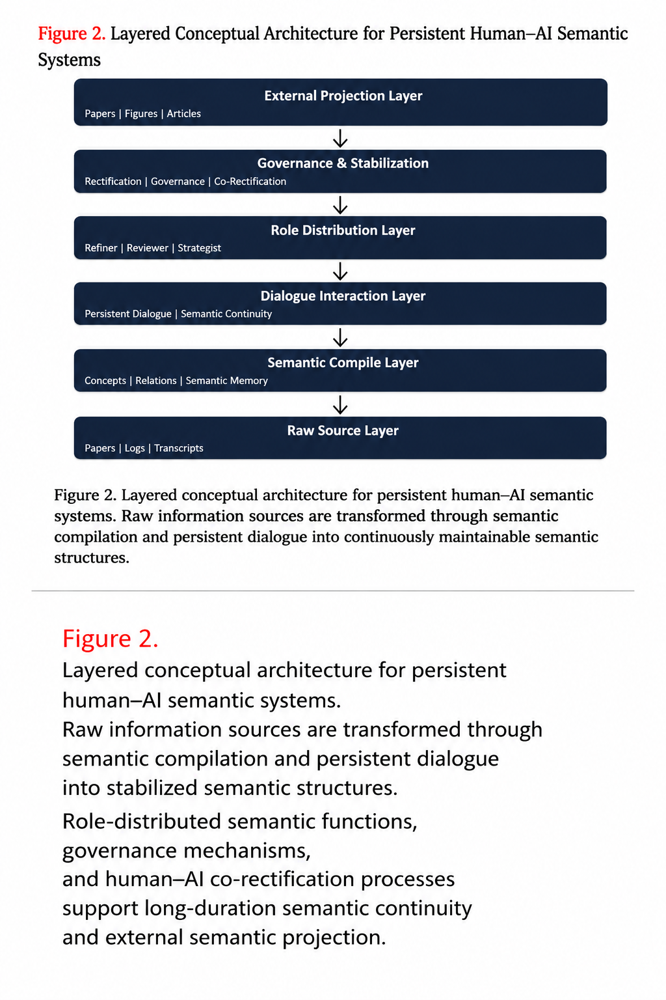
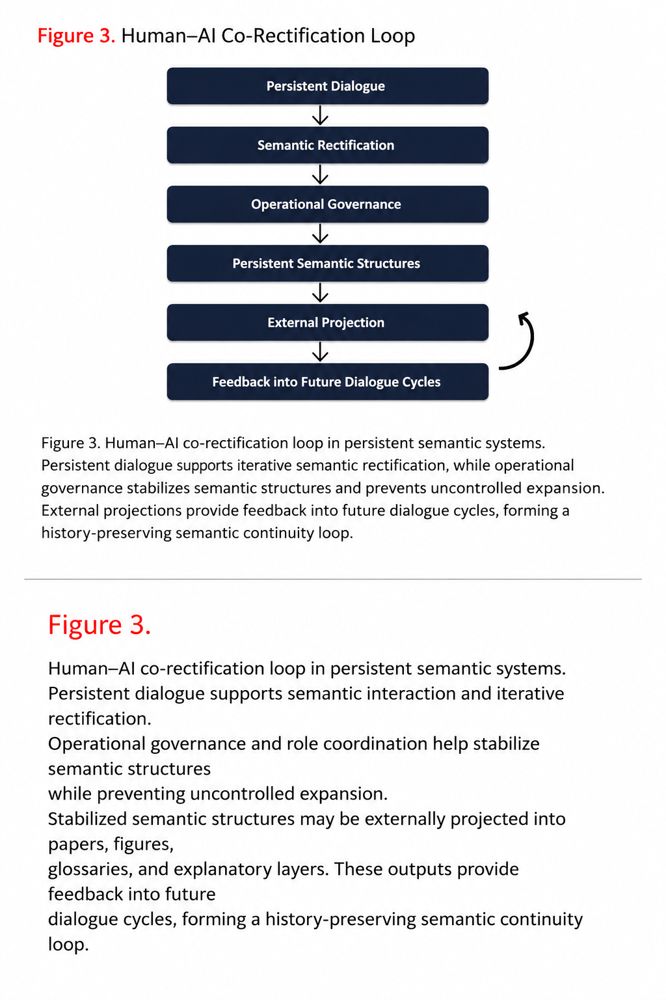

# Persistent Semantic Architecture Program

Conceptual exploration of dialogue-centered semantic architectures, persistent semantic systems, and long-duration human–AI semantic continuity.

This repository section explores semantic architectures beyond transient retrieval-centered systems.

---

# Overview

Conventional retrieval-based systems reconstruct semantic context temporarily at query time.

This research direction explores whether persistent semantic structures may instead emerge through:

* long-duration dialogue
* semantic compilation
* iterative semantic rectification
* role-distributed semantic processing
* operational governance layers
* human–AI co-rectification loops

The project investigates how semantic continuity may be stabilized and externally projected through persistent interaction systems.

---

# Relation to Existing Work

This direction was partially inspired by ongoing discussions surrounding LLM-Wiki-style semantic organization systems and persistent semantic compilation approaches.

In particular, conceptual references include:

* dialogue-centered semantic organization
* semantic compilation layers
* persistent semantic memory structures
* reusable semantic access systems

Related public materials:

* Karpathy / LLM-Wiki discussion
  https://gist.github.com/karpathy/442a6bf555914893e9891c11519de94f

This repository extends those directions toward persistent dialogue-centered semantic architectures and long-duration human–AI semantic interaction systems.

---

# Core Conceptual Figures

## Figure 1 — Transition Toward Persistent Semantic Architectures

.png)

Conventional retrieval systems reconstruct context temporarily, while persistent semantic systems maintain continuity across interaction cycles.

---

## Figure 2 — Layered Conceptual Architecture for Persistent Human–AI Semantic Systems

Layered semantic architecture including semantic compilation, dialogue continuity, governance, and external projection layers.

---

## Figure 3 — Human–AI Co-Rectification Loop

Conceptual loop structure describing persistent semantic continuity through iterative human–AI semantic interaction.

## Current Manuscript

An early manuscript version of the LLM-Wiki conceptual framework is available below.

This manuscript explores:

- persistent semantic architectures
- semantic compilation layers
- dialogue-centered semantic systems
- long-duration semantic continuity
- human–AI co-rectification structures

Current status:

- Main body: mostly completed
- Appendix: in progress
- Global refinement: ongoing

### Manuscript Draft

- [LLM-Wiki Main Text](manuscript/llm-wiki-main-text.pdf)

---

# Research Topics

Current exploration areas include:

* semantic continuity
* persistent dialogue systems
* semantic governance
* semantic stabilization
* semantic rectification
* role-distributed semantic architectures
* glossary stabilization
* long-duration semantic memory

---

# Status

This is an evolving conceptual research direction.

Additional figures, semantic-layer notes, operational models, and dialogue-centered semantic architecture studies may gradually be added.

---

