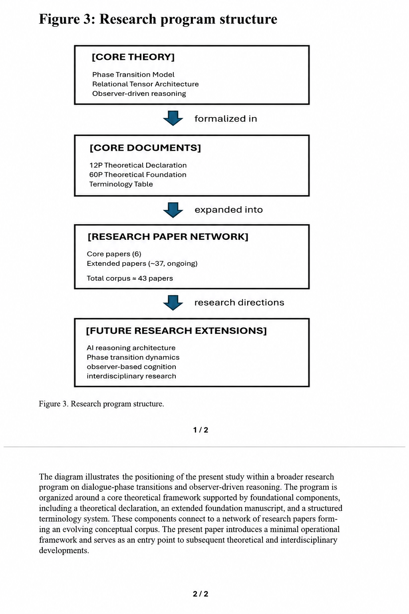

# 12P Framework — A Measurement Framework for Dialogue-Phase Emergence in LLMs

This directory contains the 12-page framework for a minimal, operational, and falsifiable account of dialogue-phase emergence in large language model reasoning systems.

Working title:

**A Measurement Framework for Dialogue-Phase Emergence in LLMs**

---

# Abstract

Large language models (LLMs) are often described as exhibiting emergent behavior primarily as a function of model scale or training conditions. However, even under fixed architecture and identical inference settings, dialogue trajectories occasionally display sudden structural reconfiguration. We argue that such events remain under-specified in existing definitions of emergence and propose an operational reformulation as a phase transition in a relational representation space derived from observable output sequences.

Specifically, we introduce a necessary condition of the form **R·P ≥ θ**, where **R** denotes rectification density, including connectivity, self-consistency, and closure aggregation, and **P** denotes reflective pressure, or accumulated unresolved structural tension. Both quantities are defined as externally computable approximations from dialogue logs, without requiring access to internal model weights.

To distinguish structural reconfiguration from mere content growth, we define a jump detection criterion using representational distance **Δ(t)** between successive structural states. We further provide a minimal and reproducible experimental protocol, including staged prompt sequences, repeated trials, and explicit falsifiability conditions, to test the hypothesis.

This framework offers an operationally observable and falsifiable account of dialogue-phase emergence in LLM reasoning systems.

---

# Purpose of This Framework

This framework is designed as a compact research entry point.

It does not attempt to compress the full theoretical foundation into a short paper. Instead, it presents a minimal position paper and operational theory that can serve as the first externally readable statement of the broader research program.

The central aim is to shift the discussion of emergence from model scale alone toward observable structural transitions in dialogue trajectories.

---

# Core Hypothesis

Dialogue-phase emergence may be observed when accumulated rectification density and reflective pressure approach a critical regime.

The core condition is expressed as:

**R · P ≥ θ**

Where:

- **R** = rectification density  
- **P** = reflective pressure  
- **θ** = critical threshold  
- **Δ(t)** = representational distance between successive structural states


The framework treats sudden structural reconfiguration as an observable transition in a relational representation space derived from dialogue outputs.

## Planned Structure

1. Introduction
   - Reformulation of the emergence problem
   - Limits of scale-only explanations
   - Position of this paper as an additional explanatory layer

2. Conceptual Core
   - Meaning tensor field
   - Rectification density R
   - Reflective pressure P
   - Jump condition R·P ≥ θ

Mathematical expression is kept minimal in the main paper.

3. Operationalization
   - Observable approximations from dialogue logs
   - Structural consistency and lexical-relational organization
   - Definition of Δ(t)
   - Identification of a candidate jump point t*

Detailed procedures may be placed in the appendix.

4. Minimal Experimental Protocol
   - Minimal test design
   - Staged prompt sequences
   - Repeated trials
   - Prediction structure
   - Falsification conditions

This section is central for external research evaluation.

5. Relation to Existing Work
   - Phase transitions
   - Dynamical systems
   - Emergent behavior
   - Representation-space analysis

6. Falsifiability

The framework includes compressed falsification conditions designed to distinguish genuine structural transition from ordinary content expansion or stylistic variation.

7. Contribution Summary

This framework contributes:

- a shift from scale-only emergence toward condition-based emergence
- an interaction-level state-variable model
- a structural jump criterion
- a minimal reproducible protocol
- a falsifiable account of dialogue-phase emergence

---

## Repository Structure

```text
12p-framework/

├── README.md
├── abstract/
├── figures/
├── terminology/
│   ├── terminology-table.md
│   ├── mini-concept-index.md
│   └── core-definitions.md
├── manuscript/
└── appendix/
```

---

## Core Figures

Figures will be added gradually.

Planned figures include:

### Figure 1 — Integrated Concept Architecture


### Figure 2 — Operational Measurement Framework


### Figure 3 — Research Program Structure



---

## Terminology Layer

The terminology directory provides supporting concept definitions for the framework.

Key terms include:

- rectification density
- reflective pressure
- representational distance
- structural jump
- semantic state space
- dialogue-phase transition
- crystallization
- relational representation space

---

## Current Status

This is an evolving research framework.

Current status:

- Abstract: available
- Figures: prepared
- Terminology resources: being organized
- Manuscript: in refinement
- Appendix: in progress

---

## Parent Repository

This framework belongs to the broader:

```text
dialogue-phase-reasoning
```

research repository.

---

## Author

Masaaki Kurosawa  
Independent Researcher
