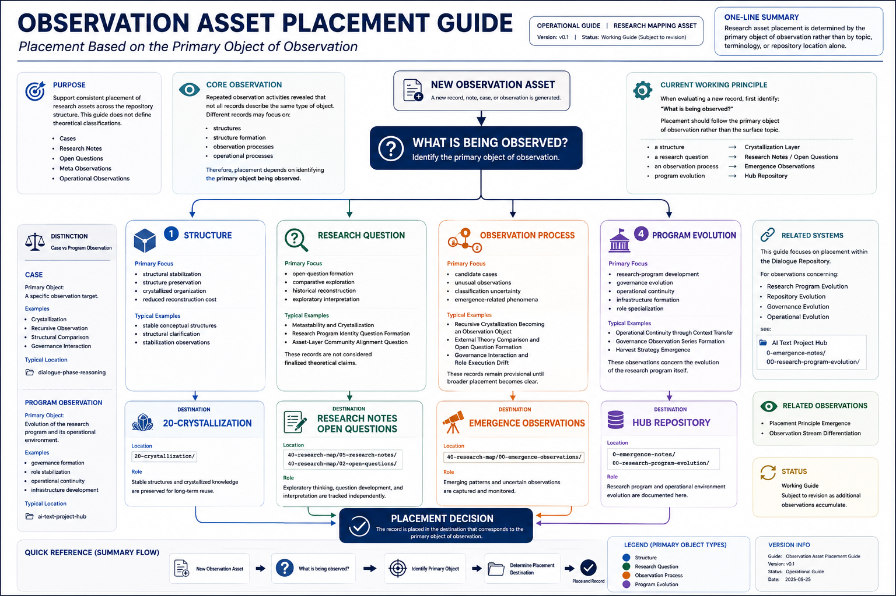

# Observation Asset Placement Guide (Working Operational Diagram)

## Purpose

This note provides a visual operational guide for placement decisions within the research repository.

The purpose is not to establish a theoretical taxonomy.

The purpose is to support consistent placement of observational assets based on the primary object of observation.

---

## Diagram



---

## Relationship to Related Documents

This diagram should be interpreted together with:

* Observation Asset Placement Guide
* Placement Principle Emergence
* Placement Principle Emergence (ASCII Representation)
* Placement Principle Working Orientation Diagram

These documents serve different purposes:

| Document                                             | Function                                           |
| ---------------------------------------------------- | -------------------------------------------------- |
| Placement Principle Emergence                        | Observation record of principle formation          |
| Placement Principle Emergence (ASCII Representation) | Structural compression of the emergence process    |
| Placement Principle Working Orientation Diagram      | Visual representation of principle emergence       |
| Observation Asset Placement Guide                    | Operational application of the placement principle |

---

## Core Operational Question

The central organizing question is:

```text
What is being observed?
```

Placement decisions should be based primarily on the object of observation rather than on terminology, topic similarity, or repository location alone.

---

## Operational Categories

The current placement workflow distinguishes among:

* Structure
* Research Questions
* Observation Processes
* Program Evolution

Each category may be directed toward a different repository destination.

---

## Interpretation

The guide reflects the current operational understanding that placement depends upon identifying the primary observation object.

The diagram therefore represents an application of the Placement Principle rather than the emergence process that originally produced it.

As operational practice has matured, placement is understood as the beginning of repository integration rather than the final step of classification.

After the primary placement decision has been made, subsequent operational activities may include:

* Repository recording
* Cross-reference maintenance
* Repository-wide consistency review

These activities preserve long-term organizational coherence while leaving the original placement decision unchanged.

---

## Related Repository Areas

Examples include:

* 20-Crystallization
* Research Notes
* Open Questions
* Emergence Observations
* Hub Repository

Additional destinations may emerge as repository organization evolves.

---

## Repository Integration

The operational workflow represented by this diagram supports placement decisions across both the Dialogue Repository and the Hub Repository.

When appropriate, complementary records may be maintained independently within different repository layers while remaining connected through Cross-reference.

This operational integration extends the Placement Principle without modifying its original conceptual foundation.

---

## Status

Working Operational Diagram

Operational guide only.

Subject to revision through future observation and repository development.

