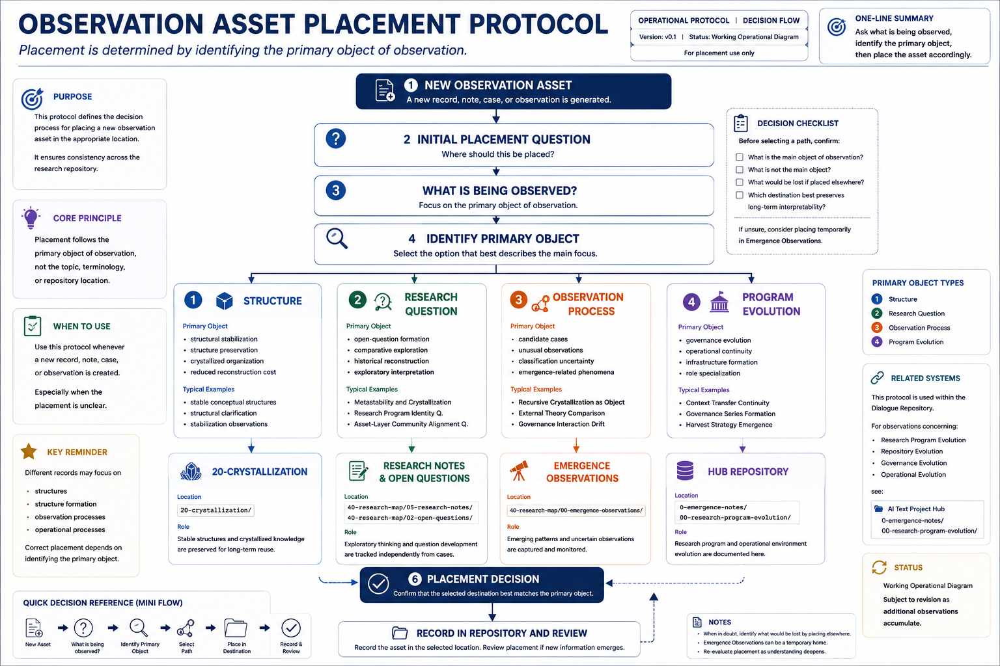

# Placement Protocol Working Operational Diagram

---



---

## Status

Working Operational Diagram

Research Mapping Asset

Version: v0.1

---

## Purpose

This document provides explanatory context for the Placement Protocol Working Operational Diagram.

The purpose is not to define theoretical classifications.

Instead, the purpose is to visually represent the operational placement procedure used throughout the research repository.

---

## Overview

The diagram translates the Observation Asset Placement Protocol into a decision-flow structure.

Its purpose is to support consistent placement of:

- Cases
- Research Notes
- Open Questions
- Emergence Observations
- Governance Observations
- Program Evolution Observations

across the repository environment.

---

## Central Question

The diagram is organized around a single operational question:

> What is being observed?

The answer determines the placement destination.

The protocol therefore prioritizes the primary object of observation rather than:

- topic similarity
- terminology overlap
- repository proximity

---

## Operational Flow

```text
New Observation Asset

↓

Initial Placement Question

↓

What is being observed?

↓

Identify Primary Object

↓

Placement Destination

↓

Repository Recording
```

---

## Primary Observation Categories

### 1. Structure

Examples:

- structural stabilization
- structural preservation
- crystallized organization
- reduced reconstruction cost

Destination:

```text
20-crystallization/
```

---

### 2. Research Question

Examples:

- open-question formation
- comparative exploration
- historical reconstruction
- exploratory interpretation

Destinations:

```text
40-research-map/
├─ 05-research-notes/
└─ 02-open-questions/
```

---

### 3. Observation Process

Examples:

- candidate cases
- unusual observations
- classification uncertainty
- emergence-related phenomena

Destination:

```text
40-research-map/
└─ 00-emergence-observations/
```

---

### 4. Program Evolution

Examples:

- governance evolution
- operational continuity
- infrastructure formation
- role specialization

Destination:

```text
ai-text-project-hub/
└─ 0-emergence-notes/
```

---

## Relationship to Related Documents

This diagram represents the operational visualization of:

- Placement Principle Emergence
- Observation Asset Placement Guide
- Observation Asset Placement Protocol

The relationship may be summarized as:

```text
Placement Principle Emergence

↓

Observation Asset Placement Guide

↓

Observation Asset Placement Protocol

↓

Placement Protocol Working Operational Diagram
```

---

## Intended Use

This diagram is intended to support:

- repository organization
- placement decision consistency
- onboarding of new research-support instances
- operational review activities
- placement validation discussions

---

## Current Assessment

Status:

Operationally useful.

Actively referenced during repository placement decisions.

Further refinement may occur as additional observation categories emerge.

---

## One-Line Summary

The Placement Protocol Working Operational Diagram visualizes the operational decision process used to place observation assets according to their primary object of observation.
