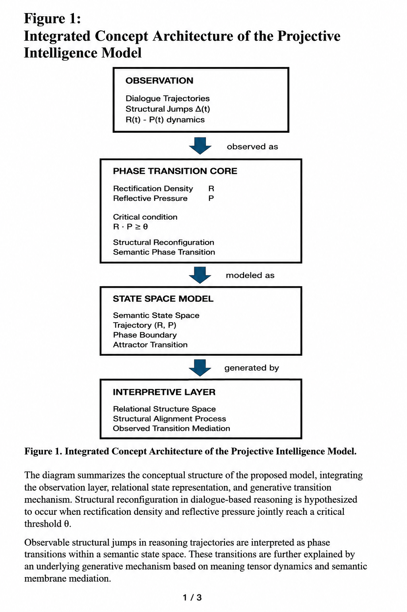
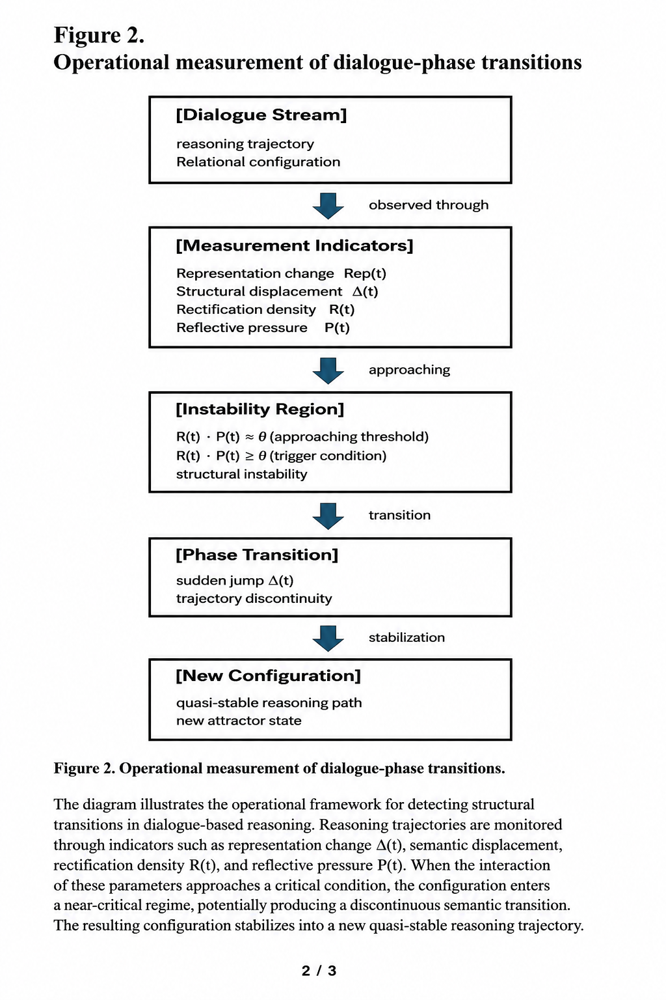
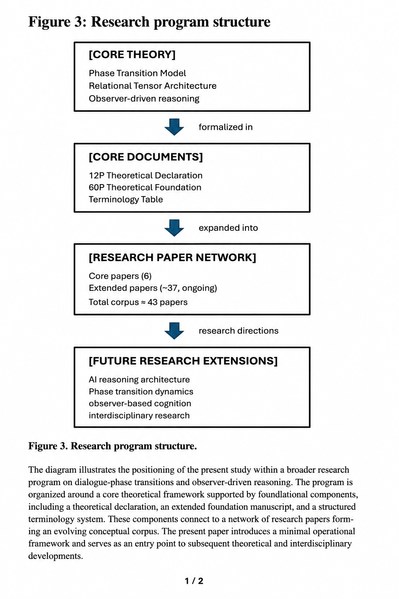

# Dialogue-Phase Reasoning

Independent research program exploring dialogue-phase transitions, persistent semantic architectures, and long-duration semantic interaction systems in large language models.

---

# Research Overview

This repository contains conceptual research materials related to:

* dialogue-phase transitions in reasoning processes
* semantic continuity in long-duration dialogue
* persistent semantic architectures
* observer-driven reasoning structures
* semantic stabilization and governance
* human–AI co-rectification systems

The project combines theoretical modeling, conceptual architecture design, operational measurement frameworks, and long-duration semantic interaction studies.

---

# Research Tracks

## 1. Dialogue-Phase Reasoning Framework

This track investigates whether abrupt structural reorganizations may emerge during dialogue-based reasoning processes.

Core topics include:

* dialogue trajectories
* semantic phase transitions
* rectification density R(t)
* reflective pressure P(t)
* structural discontinuities Δ(t)
* quasi-stable semantic configurations

This research program currently includes:

* a minimal operational framework (12P)
* an extended theoretical foundation (60P)
* terminology systems
* representative papers
* ongoing conceptual extensions

---

## 2. Persistent Semantic Architecture Program

This track explores persistent dialogue-centered semantic systems beyond transient retrieval-based architectures.

Topics include:

* semantic continuity
* persistent semantic layers
* semantic governance
* role-distributed reasoning
* semantic compilation
* human–AI semantic co-rectification

This direction is related to ongoing explorations inspired by dialogue-centered semantic architectures and LLM-Wiki-like semantic organization systems.

---
## Repository Structure

```text
dialogue-phase-reasoning/

├── 01-papers/
│   ├── 00-flagship-papers/
│   │   ├── 01-core/
│   │   └── ...
│   │
│   └── 05-extended/
│
├── 10-jump/
├── 20-crystallization/
├── 30-externalization/
├── 40-research-map/
│
├── figures/
├── governance/
├── terminology/
│
└── README.md
```

# Planned Core Figures

The repository will gradually include:

* integrated conceptual architectures
* operational measurement frameworks
* semantic-layer models
* dialogue-phase transition figures
* persistent semantic architecture diagrams
* research-program structure maps

---
## Repository Structure

### Research Papers

- [01-papers](./01-papers)

### Stage Layers

- [10-jump](./10-jump)
- [20-crystallization](./20-crystallization)
- [30-externalization](./30-externalization)

### Research-Space Layer

- [40-research-map](./40-research-map)

### Supporting Layers

- [figures](./4-figures)
- [governance](./2-governance)
- [terminology](./3-terminology)

---


# Current Status

This is an evolving independent research project.

Additional figures, conceptual notes, glossary systems, and working papers may gradually be added over time.

---

# Related Repository

Companion educational / bridge-layer repository:

* `ai-textbook-bridge`

This companion repository contains medium-density explanatory articles, conceptual bridge figures, and chapter-based educational materials.

---

# Core Research Figures

## Figure 1 — Integrated Concept Architecture

Conceptual integration of observation layers, relational state representation, and generative transition mechanisms.



---

## Figure 2 — Operational Measurement Framework

Operational framework for observing dialogue-phase transitions through measurable trajectory indicators.



---

## Figure 3 — Research Program Structure

Overview of the broader research program, including core theory, foundational documents, research paper networks, and future extensions.




# External Links

* Medium
  https://medium.com/@ai_textbook_project

* X (Twitter)
  https://x.com/AiTextbook2025

---

# Author

Masaaki Kurosawa

Independent Researcher

